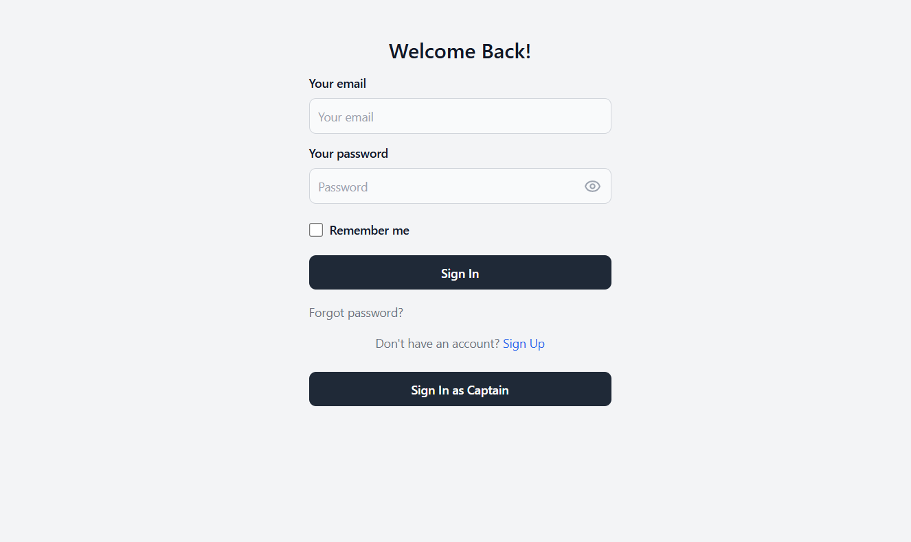
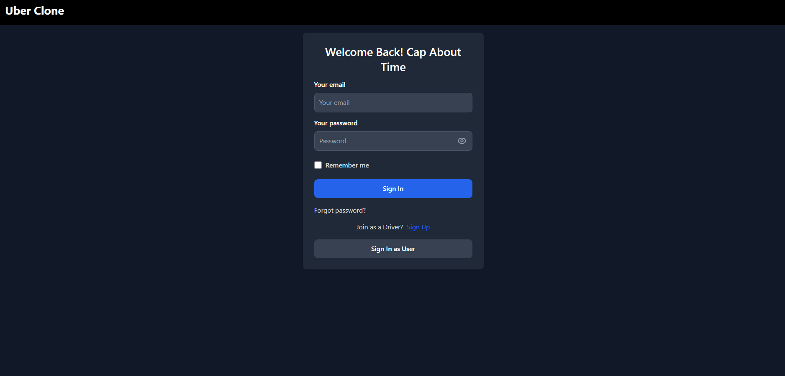
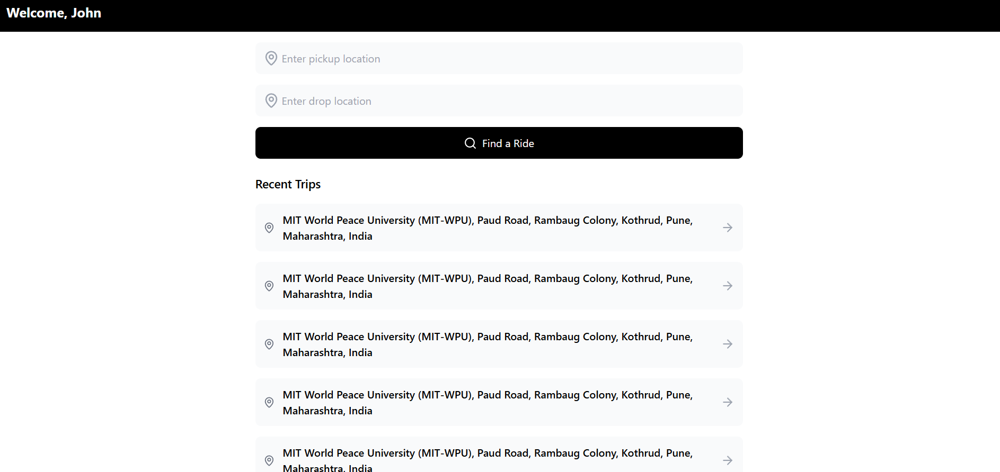
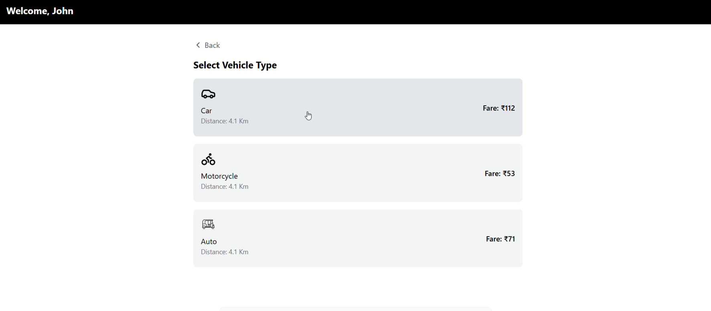
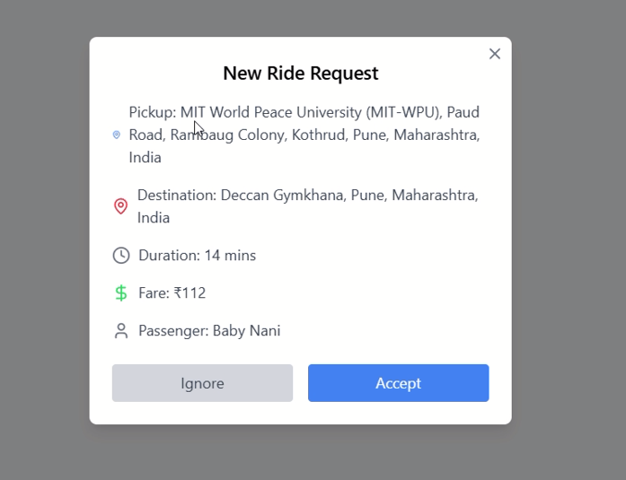
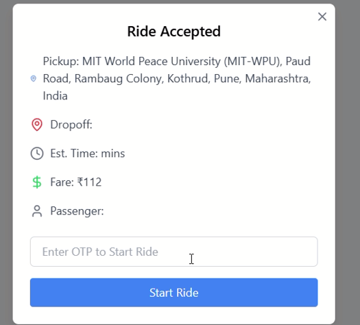
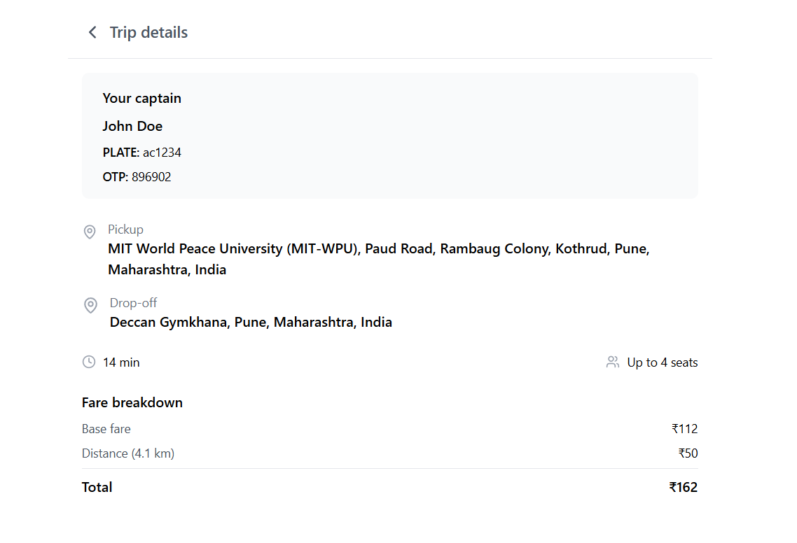
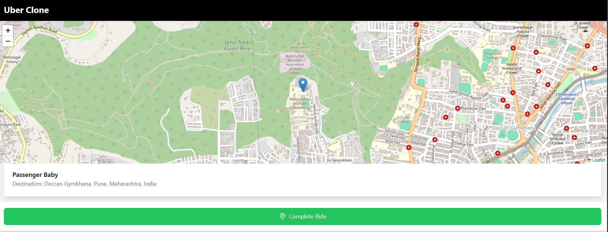
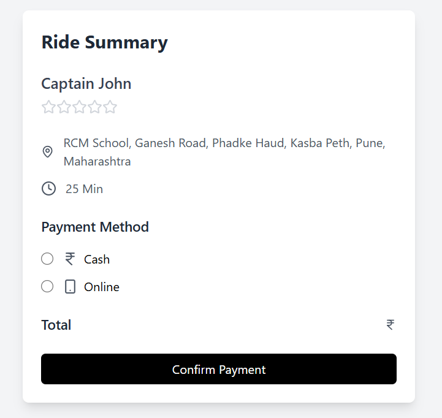
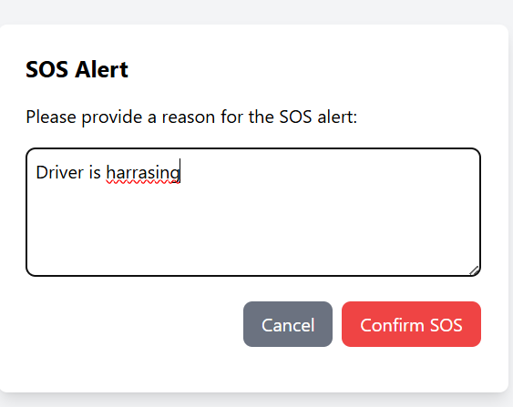

# Uber Project

This repository contains the implementation of an Uber-like application built using the MERN (MongoDB, Express.js, React, Node.js) stack. The project simulates the key features of a ride-hailing platform, including user and driver registration, ride booking, real-time tracking, and payment processing.

---

## Features

- **User and Driver Registration**
  - Users and drivers can sign up with personal and vehicle details.
- **Login and Authentication**
  - Secure login using JWT-based authentication.
- **Ride Booking**
  - Users can book rides by specifying pickup and drop-off locations.
- **Real-time Tracking**
  - Track rides in real-time using live location updates.
- **Ride Management**
  - Drivers can accept or reject rides.
- **OTP Verification**
  - Secure ride start with OTP-based validation.
- **Fare Estimation**
  - Calculate ride fares based on distance and vehicle type.
- **Payment Processing**
  - Support for online and cash payments.
- **Recent Trip History**
  - View past trips for both users and drivers.

---

## Tech Stack

### Frontend:
- **React.js**: For building the user interface.
- **CSS**: For styling the components.
- **GoMaps API**: For location and map functionalities.

### Backend:
- **Node.js**: For server-side logic.
- **Express.js**: For handling API endpoints.
- **MongoDB**: For database storage.
- **Multer**: For handling file uploads (e.g., driver identity proofs).

### Additional Libraries:
- **Axios**: For making HTTP requests.
- **JWT**: For authentication and authorization.
- **Socket.io**: For real-time location updates.

---
### Project Snippets

### Landing Page
<video controls src="./Frontend/Snippets/Landing Page.mp4" title="Title"></video>

### User Login Page


### Captain login Page


### User Dashboard


### Ride Options


### Captain Popup For Ride


### Captain otp for Starting Ride


### Rider Details 


### Captain Map


### User Map


### User Payment With rating


### Sos Form for user



---


## Installation

### Prerequisites

- Node.js installed on your machine.
- MongoDB database setup.

### Steps to Run Locally

1. Clone the repository:
   ```bash
   git clone <repository-url>
   ```

2. Navigate to the project directory:
   ```bash
   cd uber-project
   ```

3. Set up the backend:
   - Navigate to the `backend` directory:
     ```bash
     cd backend
     ```
   - Install dependencies:
     ```bash
     npm install
     ```
   - Create a `.env` file with the following variables:
     ```env
     PORT=3000
     DB_URI=your-mongodb-connection-string
     JWT_SECRET=your-secret-key
     ```
   - Start the server:
     ```bash
     npm start
     ```

4. Set up the frontend:
   - Navigate to the `frontend` directory:
     ```bash
     cd ../frontend
     ```
   - Install dependencies:
     ```bash
     npm install
     ```
   - Start the development server:
     ```bash
     npm start
     ```

5. Access the application:
   - Frontend: `http://localhost:3000`
   - Backend: `http://localhost:5000`

---

## Folder Structure

```
uber-project/
  |-- backend/
  |     |-- controllers/
  |     |-- models/
  |     |-- routes/
  |     |-- server.js
  |
  |-- frontend/
  |     |-- src/
  |         |-- pages/
  |         |-- components/
  |         |-- App.js
  |-- README.md
```

---

## Key Endpoints

### Backend

- **User Registration**: `POST /user/register`
- **Driver Registration**: `POST /driver/register`
- **Login**: `POST /login`
- **Ride Booking**: `POST /rides`
- **Real-time Tracking**: `GET /tracking`

### Frontend

- **Landing Page**
- **User Login and Signup**
- **Driver Login and Signup**
- **Ride Booking Page**
- **Live Tracking Page**
- **Payment Page**


---

## License

This project is licensed under the MIT License.

---

## Contributing

Contributions are welcome! To contribute:

1. Fork the repository.
2. Create a new branch.
3. Make your changes.
4. Submit a pull request.


